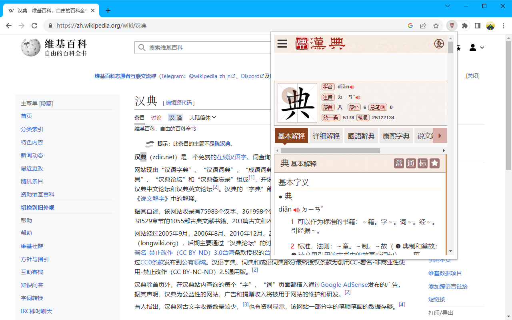
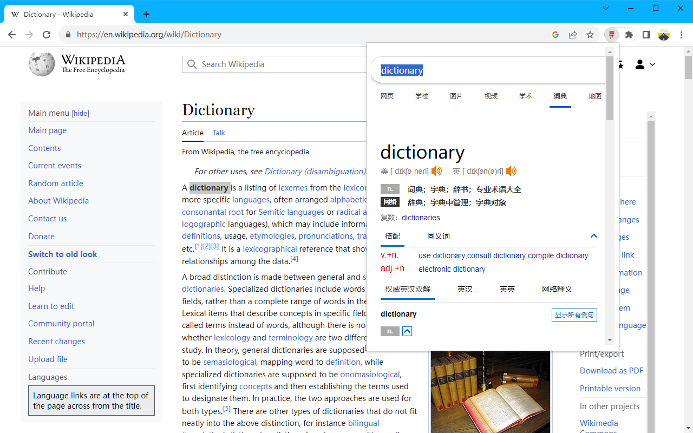
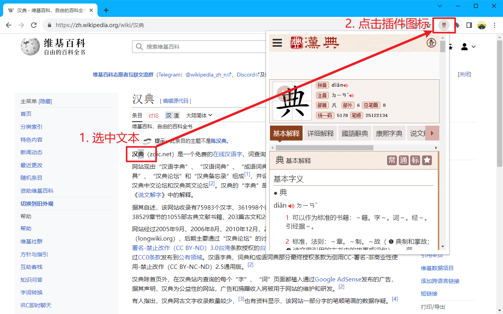

# 汉典 chrome 插件

chrome 应用商店地址：https://chrome.google.com/webstore/detail/abmbllaililangdpiapmaobkjmibdjgb

汉典 chrome 插件提供快捷的中英文字典查询服务。

使用方法：在网页中选中需要查询的字词，然后点击浏览器右上角的插件图标即可查询。（建议先固定插件图标）

如果选中的文本被识别为中文，则会查询汉典；如果识别为英文，则会查询必应词典。

## 感谢
* 汉典官网：https://www.zdic.net/
* 必应词典官网：https://cn.bing.com/dict/
* 旧版汉典插件：https://github.com/bitzip/zdic